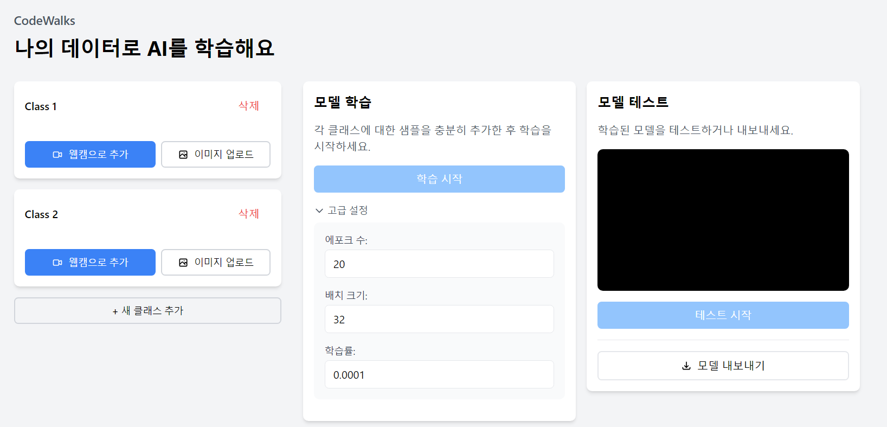
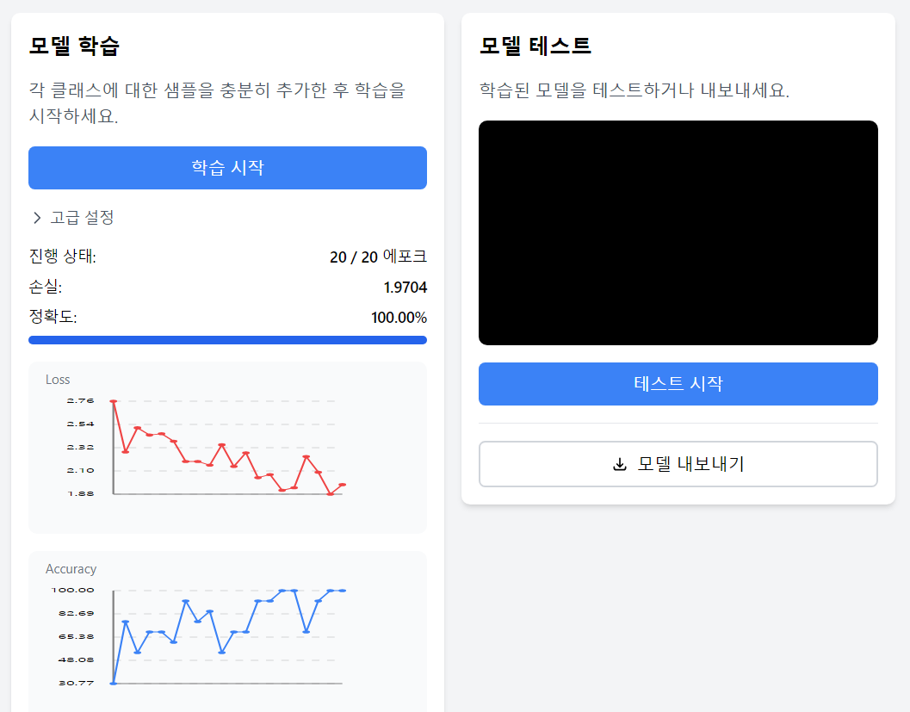

# Teachable Machine React
<p align="center">
  
</p>
Google의 Teachable Machine을 React로 구현한 웹 애플리케이션입니다. 이 프로젝트는 TensorFlow.js를 사용하여 브라우저에서 직접 머신러닝 모델을 학습하고 테스트할 수 있습니다.

## 주요 기능

- 🎯 실시간 이미지 분류 학습
- 📸 웹캠을 통한 실시간 데이터 수집
- 🖼️ 이미지 파일 업로드 지원
- 📊 실시간 학습 진행 상황 모니터링
- 🔄 실시간 웹캠 테스트
- 💾 학습된 모델 내보내기

## 시작하기

### 필수 조건

- Node.js 14.0.0 이상
- npm 또는 yarn

### 설치

1. 저장소 클론
```bash
git clone https://github.com/AshleyLee00/teachable_machine_react.git
cd teachable_machine_react
```

2. 의존성 설치
```bash
npm install
# 또는
yarn install
```

3. 개발 서버 실행
```bash
npm start
# 또는
yarn start
```

## 사용 방법
<p>
   
   </p>

1. **클래스 추가**
   - '+ Add New Class' 버튼을 클릭하여 새로운 클래스 추가
   - 각 클래스의 이름을 변경 가능

2. **데이터 수집**
   - 웹캠 또는 이미지 업로드를 통해 각 클래스의 학습 데이터 수집
   - 각 클래스당 충분한 수의 샘플 확보 권장

3. **모델 학습**
   
   - 학습 설정 조정 (에포크, 배치 크기, 학습률)
   - '모델 학습시키기' 버튼 클릭
   - 실시간으로 학습 진행 상황, 손실값, 정확도 확인

4. **모델 테스트**
   - 웹캠을 통한 실시간 테스트
   - 예측 결과와 신뢰도 확인

5. **모델 내보내기**
   - 학습된 모델을 TensorFlow.js 형식으로 저장

## 기술 스택

- React
- TensorFlow.js
- Tailwind CSS
- MobileNet (전이학습)

## 성능 최적화

- 메모리 관리를 위한 TensorFlow.js tidy 사용
- 예측 간격 조절을 통한 CPU 부하 최적화
- 효율적인 웹캠 스트림 처리
- 불필요한 렌더링 방지

## 라이선스

MIT